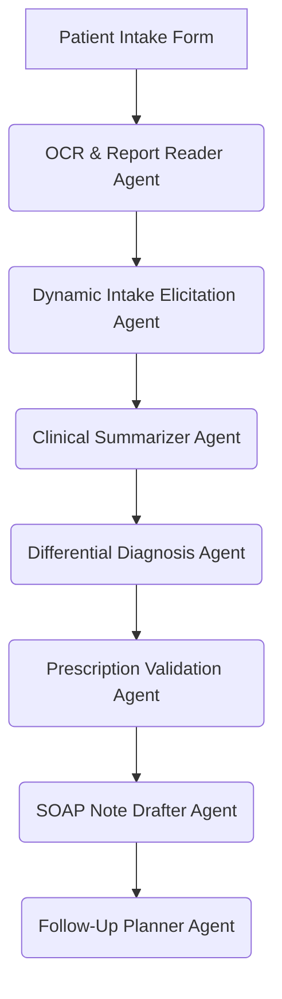

# 04. Integration Plan, Backend Roadmap & Next Steps

This document outlines the **integration plan** to transition the current frontend mockup into a fully operational, service-connected prototype. It covers the database schema, LangGraph agent workflows, API gateways, and deployment milestones.

---

## 🔗 Architecture Layout & API Gateways

The system uses a decoupled microservices architecture with a frontend coordinator:

```
                  +--------------------------------+
                  |  Next.js 14 Frontend Portal    |
                  |  (Reception, Junior, Senior)   |
                  +---------------+----------------+
                                  |
                                  | REST / JSON
                                  v
                  +---------------+----------------+
                  |    Laravel 12 API / Gateway    |
                  |     (BFF & Database Auth)      |
                  +-------+---------------+--------+
                          |               |
             SQL / CRUD   |               | REST / gRPC
                          v               v
            +-------------+---+       +---+------------+
            |  PostgreSQL DB  |       | FastAPI Engine |
            |  (EMR Storage)  |       | (LangGraph Core)
            +-----------------+       +---+--------+---+
                                          |        |
                         Vector Similarity |        | S3 Upload
                                          v        v
                                     +----+---+  +-+------------+
                                     | Qdrant |  | MinIO Storage|
                                     +--------+  +--------------+
```

1.  **Laravel 12 BFF (Backend-for-Frontend):** Handles authentication (Sanctum/JWT), session validation, role access validation, EMR write/read actions, and logs prescriptions.
2.  **FastAPI AI Orchestrator:** Manages the LangGraph agent pipelines, performs OCR, and interacts with LLMs.
3.  **Cross-Service Communication:** Next.js requests are routed through Laravel. When AI services are needed, Laravel calls the FastAPI endpoints asynchronously, caching intermediate steps in Redis.

---

## 🤖 AI Agent Workflow (LangGraph)

The FastAPI engine runs 9 autonomous LangGraph agents to power the clinical workflows:



1.  **Report Reader Agent (OCR & Vision):** Uses Gemini Vision to parse uploaded clinical reports (PDFs, images) and extract key abnormal findings.
2.  **Intake Elicitation Agent:** Analyzes the chief complaint and dynamically generates follow-up questions in real time during the junior doctor's intake.
3.  **Clinical Summarizer Agent:** Synthesizes vitals and questionnaire answers into a structured clinical summary.
4.  **Differential Diagnosis Agent:** Runs similarity searches against Qdrant vector databases to suggest diagnoses based on historical outcomes and clinical guidelines.
5.  **Prescription Validation Agent:** Evaluates the selected diagnosis and drafted medications against the patient's EMR allergy profile, highlighting cross-reactions and drug-drug interactions.
6.  **SOAP Note Drafter Agent:** Compiles subjective/objective inputs into standard clinical SOAP formats.

---

## 📅 Roadmap & Next Phases

The project will follow a structured week-by-week plan to deliver the complete system:

```
📦 Phase 3: DB & Auth (Weeks 4-5)
  ├── Implement PostgreSQL Migrations (EMR tables, queues, logs)
  ├── Set up Laravel Sanctum authentication for reception, junior, and senior doctor roles
  └── Connect frontend stores to Laravel API routes

🤖 Phase 4: FastAPI & LangGraph (Weeks 6-8)
  ├── Implement Python FastAPI wrapper with LangGraph orchestration
  ├── Configure Report Reader Agent (Gemini Vision OCR API)
  └── Implement Intake Elicitation Agent for dynamic questioning

🧠 Phase 5: Vector DB & RAG (Weeks 9-10)
  ├── Set up Qdrant vector database service
  ├── Build embedding pipeline for clinical guidelines and anonymized EMR history
  └── Connect Differential Diagnosis Agent to similarity search

🧪 Phase 6: Validation, Docker & Deployment (Weeks 11-12)
  ├── Configure docker-compose.yml (Postgres, Qdrant, MinIO, Redis, Laravel, FastAPI, Next.js)
  └── Deploy prototype staging server on VPS
```

---

## 🧪 Verification & QA Strategy

To ensure clinical accuracy and system stability, the following verification plan will be implemented:

### 1. Automated Integration Tests
*   **API Verification:** Verify endpoints conform to the spec defined in [10_API_CONTRACT.md](file:///c:/Users/Viva/Downloads/medimind-dev-plan/.dev/10_API_CONTRACT.md).
*   **Constraint Checking:** Write unit tests to verify that prescribing a drug a patient is allergic to triggers the appropriate flag in `PrescriptionBuilder`.

### 2. Manual Workflow Verification
*   **Register & Forward:** Register a test patient, forward them to the junior doctor, log symptoms, generate a summary, sign a SOAP note as the senior doctor, and verify the receptionist and junior doctor can view the signed outputs.
*   **LLM Hallucination Audits:** Audit generated SOAP notes against source questionnaires to ensure the LLM output is grounded in documented clinical inputs.
