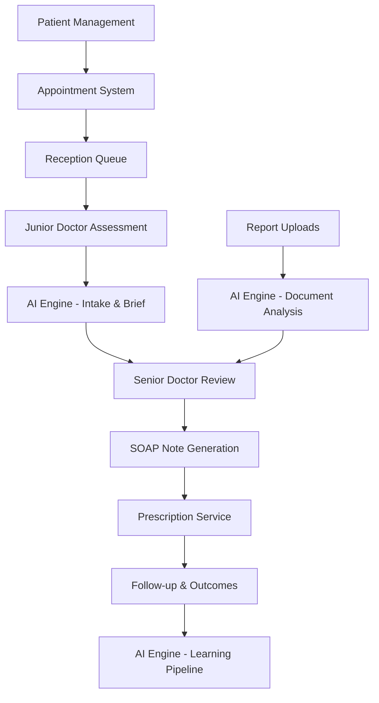
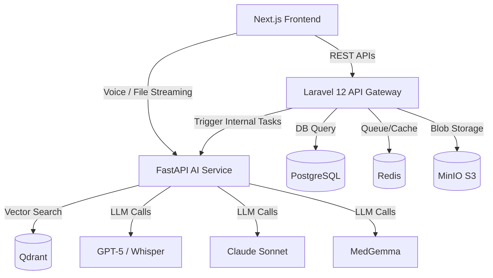

# PHASE 1: PROJECT ANALYSIS & INVENTORY

## 1. Functional Requirement Matrix

| Module | Feature | Description | Priority |
|---|---|---|---|
| **Patient Management** | Patient Registration | Capture demographic and baseline health data. | High |
| | Consent Capture | Capture dynamic consent configurations (Data, AI, Follow-up). | High |
| | Profile Update | Update patient demographic info. | Medium |
| **Appointment System** | Slot Booking | Book, reschedule, cancel appointments. | High |
| | Queue Display | Display active token numbers and estimated wait times. | High |
| **Consultation & Triage** | Junior Doctor Intake | Dynamic interactive form & voice input. | High |
| | Vitals Logging | Standard BP, HR, SpO2 capture. | High |
| **AI Doctor Brief** | Brief Generation | Extract historical info + current intake into summary. | High |
| | Risk Flagging | Alert for critical symptomatic red flags. | High |
| **Report Reader** | PDF/Image Upload | Process and summarize medical artifacts. | High |
| **Doctor Console** | Clinical Review | Doctor reviews AI generated case summary. | High |
| | Diagnosis Entry | Selection of ICD-10/11 diagnoses. | High |
| | SOAP Generation | Auto-drafting of the SOAP note format. | High |
| | Prescription | Drug conflict checking and prescription issuing. | High |
| **Follow-up** | Outcome Tracking | Scheduled follow-up with WhatsApp/SMS outcome collection. | Medium |

## 2. Technical Requirement Matrix

| Component | Technology | Version | Purpose |
|---|---|---|---|
| **Frontend UI** | Next.js | 14 | App router, patient/doctor portals. |
| **State Management** | Zustand & React Query | Latest | Client-side caching and state. |
| **Backend Core** | Laravel | 12 (PHP 8.3) | Core REST APIs, auth, queue orchestration. |
| **Admin Panel** | Filament PHP | v3.2 | Rapid admin dashboards. |
| **AI Layer Core** | FastAPI | Latest (Python 3.12) | LangGraph Agents, RAG pipeline, Model routing. |
| **Primary Database** | PostgreSQL | 16 | Relational data persistence. |
| **Vector Database** | Qdrant | Latest | Embedding storage for Guidelines & Medical Context. |
| **Cache/Message Queue**| Redis | 7 | Job queuing and ephemeral cache. |
| **Object Storage** | MinIO | S3-Compatible | PDFs, Reports, Audios. |

## 3. Module Dependency Diagram

## 4. API Dependency Diagram

