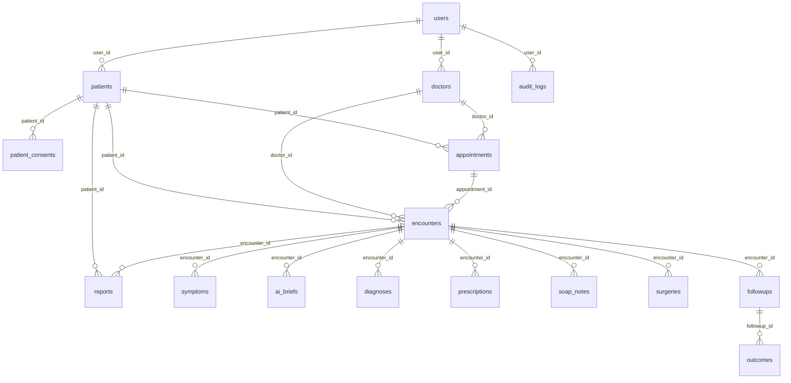

# PHASE 4: DATABASE DESIGN & ERD

## PostgreSQL Database Entity Relationship Diagram

## Schema Details

The comprehensive relational schema includes:
1. `users` (id, name, email, mobile, password, role, status)
2. `patients` (id, patient_code, name, dob, gender, mobile, abha_id, etc.)
3. `patient_consents` (id, patient_id, consent_type, consented, ip, etc.)
4. `doctors` (id, user_id, registration_number, specialization, fee, etc.)
5. `appointments` (id, appointment_no, patient_id, doctor_id, date, status, etc.)
6. `encounters` (id, encounter_no, appointment_id, status, type, etc.)
7. `symptoms` (id, encounter_id, collected_via, symptoms(json), etc.)
8. `ai_briefs` (id, encounter_id, brief_text, risk_level, similar_cases(json), etc.)
9. `reports` (id, patient_id, encounter_id, type, file_path, ai_summary, etc.)
10. `diagnoses` (id, encounter_id, icd_code, diagnosis_name, etc.)
11. `prescriptions` (id, encounter_id, medicines(json), instructions, etc.)
12. `soap_notes` (id, encounter_id, subjective, objective, assessment, plan, etc.)
13. `surgeries` (id, patient_id, doctor_id, surgery_name, status, etc.)
14. `followups` (id, encounter_id, scheduled_date, status, medium, etc.)
15. `outcomes` (id, followup_id, treatment_worked, symptom_scores(json), etc.)
16. `audit_logs` (id, user_id, action, resource_type, old_values(json), etc.)
17. `ai_analysis_log` (id, patient_id, encounter_id, agent_name, status, etc.)

## Vector Database (Qdrant)

Collections configured:
- `medical_guidelines`
- `doctor_notes`
- `patient_history`
- `research_papers`
- `specialty_packs`
- `drug_knowledge`
