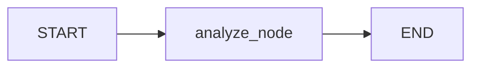
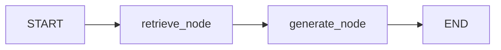

# PHASE 7: ADVANCED RAG & MULTI-AGENT WORKFLOWS

This document details the design, configuration, and endpoint routing for the Advanced RAG (Retrieval-Augmented Generation) & LangGraph Agent workflows implemented in the Python **medimind-ai-engine** microservice.

---

## 1. Overview of the Module
The Advanced RAG & Agents module introduces the capability to process clinical documents (e.g., patient lab reports), store their semantic representations in a vector database, and perform context-aware clinical conversations. 

Key operations:
1. **Document Text Extraction:** Page-by-page PDF extraction using `PyPDF2`.
2. **Chunking & Indexing:** Chunks text and generates 1536-dimensional embeddings (using OpenAI or a deterministic mathematical mock model fallback) indexed into an in-memory instance of the **Qdrant** vector database.
3. **Report Analyzer Agent:** A LangGraph pipeline (`analyze -> END`) that analyzes reports for abnormalities and structures findings.
4. **RAG Chat Assistant:** A LangGraph pipeline (`retrieve -> generate -> END`) that queries context in Qdrant using metadata filters and generates evidence-based answers.

---

## 2. In-Memory Vector Store (Qdrant)

### 2.1 Collection Configuration
* **Collection Name:** `medimind_documents`
* **Vector Configuration:** Size = `1536`, Distance Metric = `Cosine`
* **Point ID Requirements:** Points must be indexed using valid UUID string formats (e.g. `str(uuid.uuid4())`).

### 2.2 Payload Schema & Indexing
Each text chunk is indexed into Qdrant alongside a rich metadata payload to enable precise filtering:
```json
{
  "patient_id": 1,
  "encounter_id": 101,
  "chunk_index": 0,
  "text_chunk": "Patient has severe throat pain and mild anemia with low hemoglobin..."
}
```

### 2.3 Strict Multi-Tenant Metadata Filters
To prevent cross-patient data leaks and ensure HIPAA compliance, document retrieval queries enforce a metadata constraint:
* **Query Filter:** Every similarity search includes a `Filter` requiring an exact match on `encounter_id`.
* **Qdrant Query Implementation:**
  ```python
  results = self.client.query_points(
      collection_name=self.collection_name,
      query=vector,
      query_filter=models.Filter(
          must=[
              models.FieldCondition(
                  key="encounter_id",
                  match=models.MatchValue(value=encounter_id)
              )
          ]
      ),
      limit=top_k
  )
  ```

---

## 3. LangGraph Workflow Architectures

### 3.1 Report Analyzer Graph
Processes report text, extracts summary/abnormalities, and detects patient identifiers.

* **State Struct (`AnalyzerState`):**
  * `text`: Source text.
  * `findings`: Parsed JSON dict from the LLM or Mock fallback.
  * `abnormalities`: List of critical clinical findings detected.
  * `status`: Extraction status (`pending`, `success`, `failed`).

### 3.2 Conversational RAG Chat Assistant Graph
Queries context from Qdrant vector database and synthesizes responses based only on relevant medical files.

* **State Struct (`ChatState`):**
  * `query`: Natural language question.
  * `encounter_id`: Filtering constraint.
  * `history`: Conversational history list.
  * `context`: Retrieved text chunks.
  * `response`: Generated conversational answer.

---

## 4. API Endpoint Specifications

All endpoints are protected by the `verify_internal_secret` dependency and require the `X-Internal-Secret` header.

### 4.1 Analyze Report
* **Endpoint:** `POST /api/ai/analyze-report`
* **Request (ReportAnalysisRequest):**
  ```json
  {
    "file_path": "path/to/report.pdf",
    "patient_id": 1,
    "encounter_id": 101
  }
  ```
* **Response (ReportAnalysisResponse):**
  ```json
  {
    "success": true,
    "summary": "Clinical report parsed successfully.",
    "abnormalities": [
      "Serum cholesterol elevated (240 mg/dL - High)"
    ],
    "patient_info_detected": {
      "name": "John Doe",
      "report_type": "Lab Report"
    }
  }
  ```

### 4.2 Conversational RAG Chat
* **Endpoint:** `POST /api/ai/chat`
* **Request (ChatRequest):**
  ```json
  {
    "query": "Is the patient allergic to Penicillin?",
    "encounter_id": 202,
    "history": []
  }
  ```
* **Response (ChatResponse):**
  ```json
  {
    "success": true,
    "response": "[MOCK RAG RESPONSE] Based on the patient's record, they are allergic to Penicillin.",
    "context": "Patient is allergic to Penicillin."
  }
  ```

---

## 5. Verification & Automated Tests
A suite of 9 tests is implemented in [test_rag_agents.py](file:///c:/Users/Viva/Downloads/medimind-dev-plan/medimind-ai-engine/tests/test_rag_agents.py):
1. **Document Processor Tests:** File not found handling and mock PDF page text extraction.
2. **Vector Store Tests:** Insertion and strict `encounter_id`-filtered retrieval.
3. **LangGraph Agent Workflow Tests:** Report analyzer output mapping and RAG chat compilation.
4. **FastAPI Route Integration Tests:** Unauthorized route blocking (checks headers) and successful end-to-end mocks.

### Run Tests Command
Run the tests using the local python virtual environment:
```powershell
.\venv\Scripts\python.exe -m unittest tests/test_rag_agents.py
```
