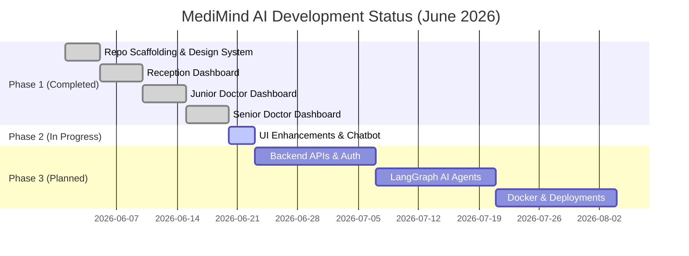

# MediMind AI — Project Live Update Index

Welcome to the **MediMind AI Live Update Documentation**. This folder contains a comprehensive, highly detailed status update of everything that has been implemented in the project up to today, **June 22, 2026**.

---

## 📂 Document Index

Click on the files below to view specific reports on the current project status:

| Document | Content & Purpose |
| :--- | :--- |
| 📄 **[01_COMPLETED_MILESTONES.md](file:///c:/Users/Viva/Downloads/medimind-dev-plan/project_live_update/01_COMPLETED_MILESTONES.md)** | Full chronological Git commit history, major milestones, and features built in past sprints. |
| 📄 **[02_CURRENT_WORK_IN_PROGRESS.md](file:///c:/Users/Viva/Downloads/medimind-dev-plan/project_live_update/02_CURRENT_WORK_IN_PROGRESS.md)** | Detailed analysis of the uncommitted, active working branch changes (vital updates, Chatbot, collapsible accordion, custom drug modals, and dashboard syncs). |
| 📄 **[03_ARCHITECTURE_AND_DASHBOARDS.md](file:///c:/Users/Viva/Downloads/medimind-dev-plan/project_live_update/03_ARCHITECTURE_AND_DASHBOARDS.md)** | Deep-dive into frontend route structure, design system tokens, role-based consoles (Reception, Junior Doctor, Senior Doctor), and Zustand global stores. |
| 📄 **[04_INTEGRATION_AND_NEXT_STEPS.md](file:///c:/Users/Viva/Downloads/medimind-dev-plan/project_live_update/04_INTEGRATION_AND_NEXT_STEPS.md)** | The blueprint for the upcoming implementation phases, backend integration (FastAPI + Laravel), database schema migrations, and LangGraph agent pipelines. |

---

## 📊 High-Level Project Status Dashboard

### Module Status Summary

*   **Frontend Core & Routings:** ✅ **100% Complete**
*   **Design System & Layouts:** ✅ **100% Complete**
*   **Reception Console:** ✅ **100% Complete**
*   **Junior Doctor Workspace:** 🔄 **95% Complete** *(Active UI Polish & Modal integrations)*
*   **Senior Doctor Console:** 🔄 **95% Complete** *(Chatbot & Prescription enhancements in progress)*
*   **Backend Scaffolding:** ✅ **100% Complete** *(Empty directory structures configured for Clean Architecture)*
*   **Backend API Implementation:** 🔄 **Planned** *(Laravel BFF + FastAPI AI Engines)*
*   **AI Agent Workflows (LangGraph):** 🔄 **Planned**

---
> **Note:** The documents in this directory are live assets meant to keep developers, architects, and stakeholders aligned. Please navigate the links above or inspect each file in this directory to review technical specifications.
